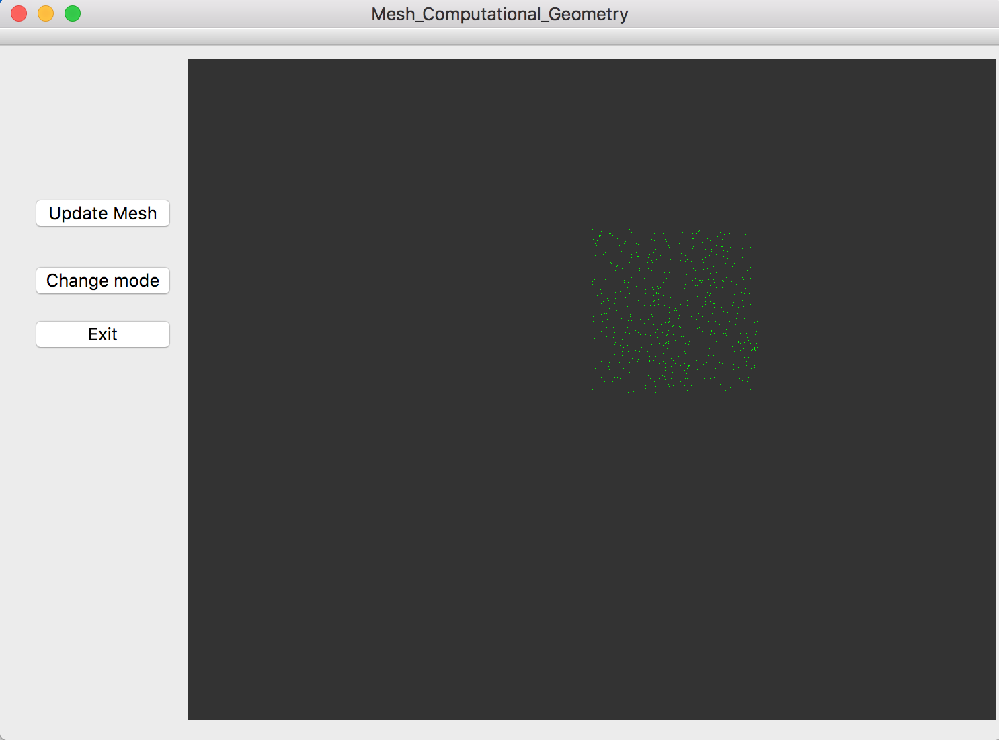
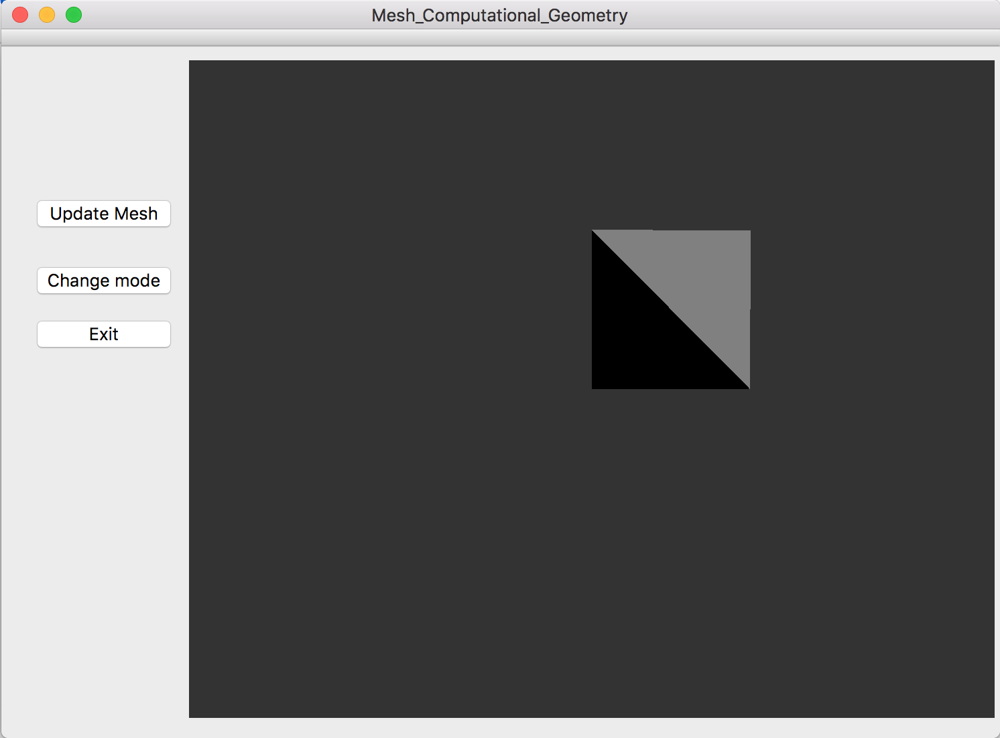
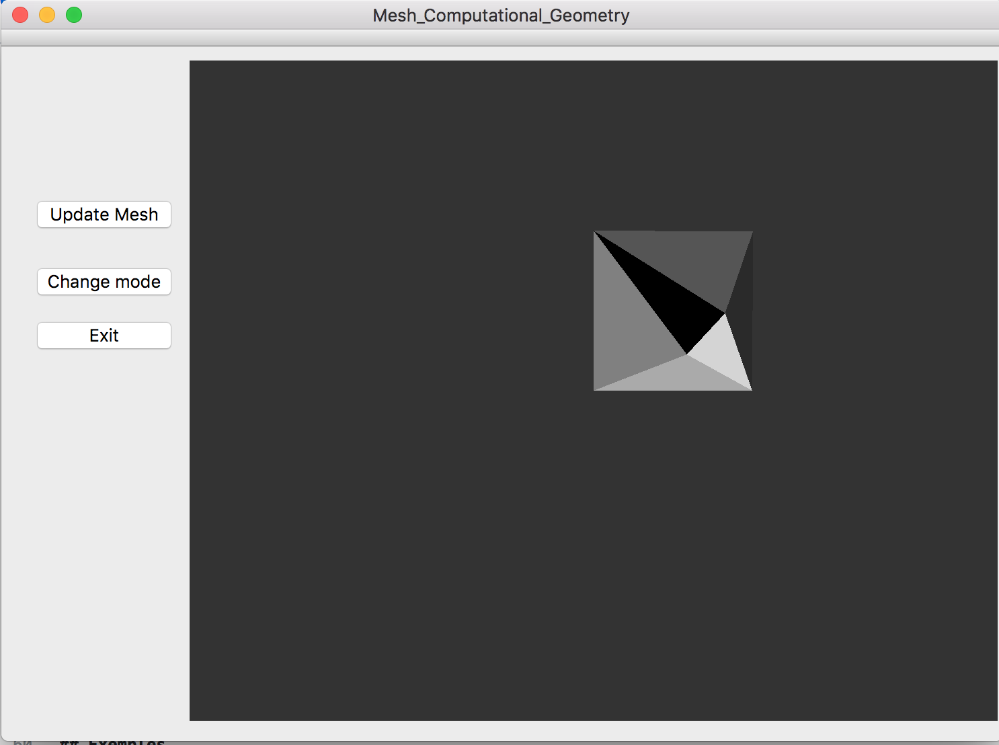
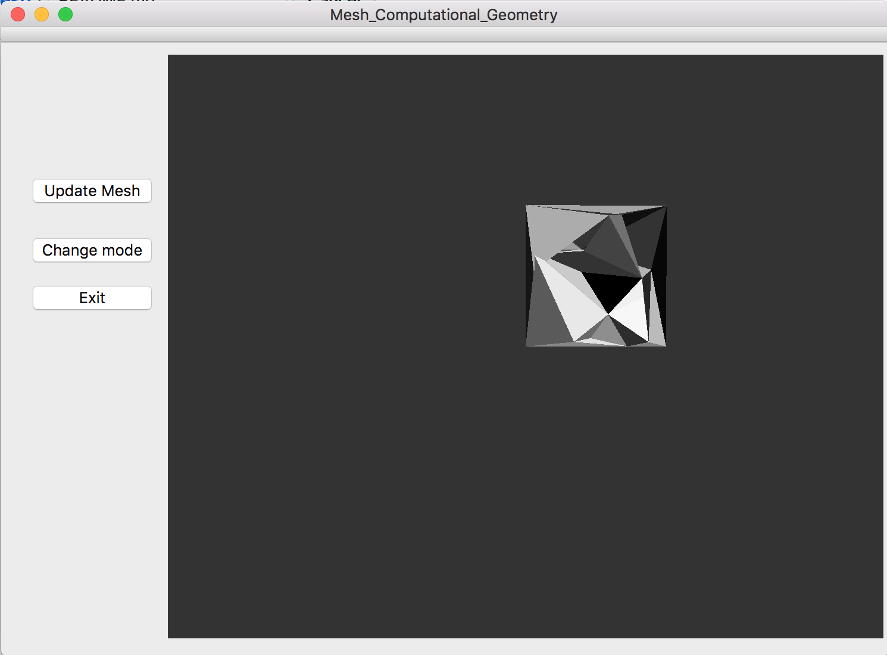
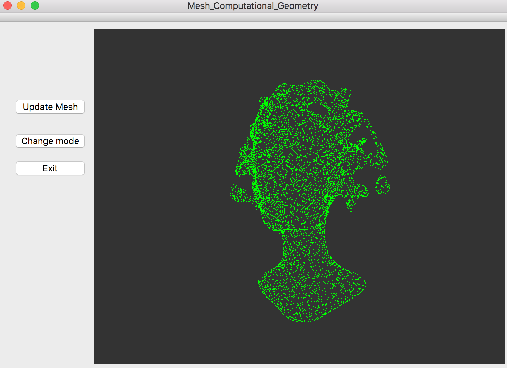

# Mesh Computational Geometry
This little project is about mesh loading and creation, with delaunay triangulation, done in C++ (with Qt for the display)

## Installation

To install the project, you will need Qt Creator installed on your computer. You can then simply download the entire folders on your computer and load the .pro file in Qt.

Do not forget to change the path names on lines 10 to 12 in mesh.cpp to the .off you wish to load from the **terrains** folder.

## Details

You will find in this project multiple things done from the original given code (quickly visible in mesh.h).
Most of the work done will be in mesh.h and mesh.cpp, which are the main files for the mesh structure.

### Classic geometry with C++ classes

First are the basics for a geometric project :

* Definition of a point and the operators linked (scalar and vectorial products, norm, phi function, ...)
* Definition of a vertice in a mesh (Point linked, adjacent face, index in the global vector, ...)
* Definition of a face in a mesh (Vertices linked, adjacent faces, area, ...)

### Iterators and circulators

You will then find multiples iterators and circulators done to travel across faces/vertices :

* Iterator on faces, to travel across all faces of the mesh
* Iterator on vertices, to travel across all vertices in the mesh
* Circulator on faces, to travel across all adjacent faces to a given vertice
* Circulator on vertices, to travel across all adjacent vertices to a given vertice

### Laplacian

The next utility done is the calcul of the laplacian on a given vertice, which will be using the circulator on faces defined earlier with a cotan calcul defined in the point class.

### Loading .off files

After these helping tools, you will find directly in the mesh.cpp the .off file (mesh file with vertices and faces defined inside) loading :

* Loading of the vertices directly in the vector reserved for it
* Loading of the faces in the given vector, coupled with a *map* feature to give more details for each face (i.e the adjacent faces index)
* Creation of a boundary box (created by 2 triangles) for points-only mesh

### Creation of a mesh step by step

The final tool coded in this project is the creation of a trianglulation for a points-only mesh loaded.

The main function needed is to add a point in a already existing triangulation. To do this, you will find a function dividing an already existing triangle into 3 triangles linked to a point within (split method).

To know wich triangle contains the point to add (there is always one since we created a boundary box), a function exists using the three 2D points orientation predicate.

### Delaunay triangulation

To add the Delaunay criter to the previously made triangulation, you will find a *flip* method that will flip an edge connecting 2 faces to the opposing edge.

The last step is then to flip the edges that are *illegal*, i.e not locally from Delaunay, in an iterative way (when flipping an edge, you will have to check the adjacent edges, and so on).

The implementation is then very easy : Every time we want to add a point in the triangulation, we will divide the triangle containing the point in 3 triangles and check the illegal-condition of the 3 edges from the original triangle (and iterate over it).

## Exemples

Here is the points-only mesh loaded (points view) :

which is also in the triangulation (/faces) view (via the **Change mode** button) :

when no points beside the bounding box is added. Now if we add 2 points in the triangulation (via the **Update mesh** button) :

Now with a lot of points added :

Finally, the loading of a complete mesh with an already existing triangulation :

